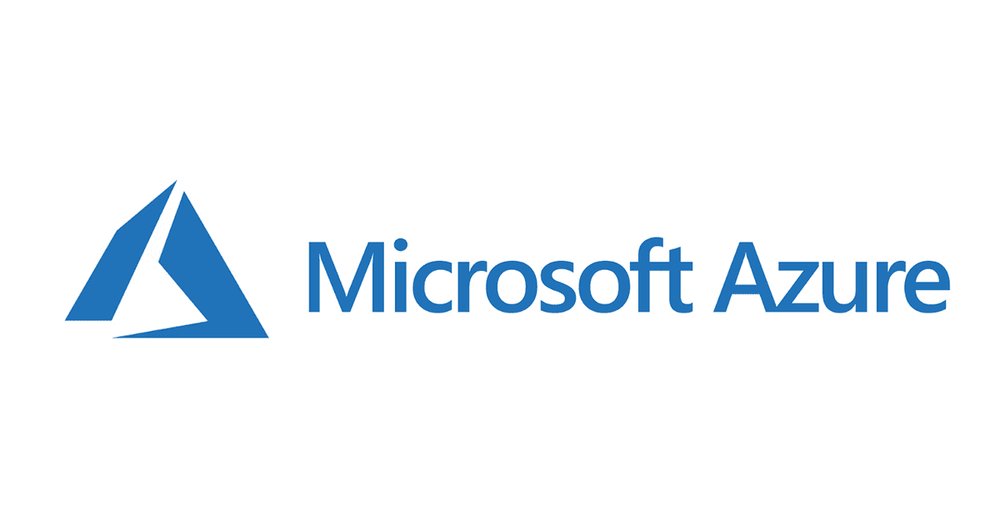

# Introdução ao Projeto Azure IAM Hardening

Este projeto, foi desenvolvido com o objetivo principal de aprimorar minhas habilidades práticas na plataforma Microsoft Azure, especialmente no gerenciamento de identidades e controles de acesso (IAM).

Durante o projeto, explorei funcionalidades como Microsoft Entra ID, RBACs (Role-Based Access Control) e testes de permissões, com foco em entender na prática como os privilégios podem ser configurados, limitados e auditados dentro de um ambiente Azure.

---

O intuito é criar uma base sólida de experiência prática em segurança de identidade na nuvem, aplicando conceitos aprendidos em estudos teóricos e certificações, e desenvolvendo um olhar crítico sobre as melhores práticas de hardening em ambientes corporativos.

---