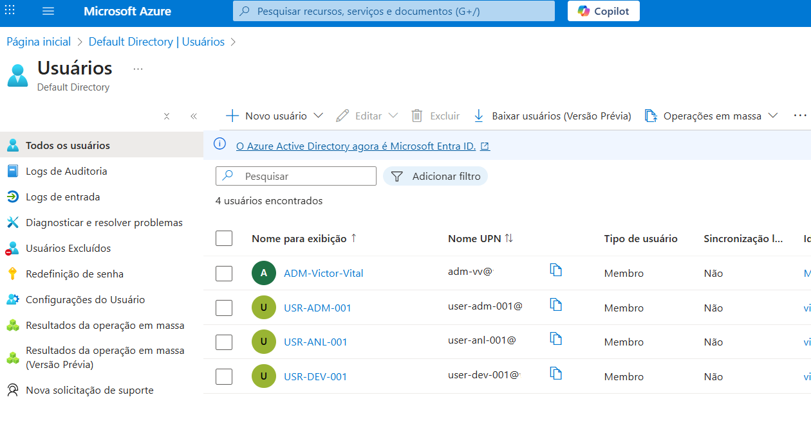

# Configuração do ambiente Azure.

Neste arquivo, descrevo como configurei o ambiente do projeto Azure IAM Hardening, preparando tudo para realizar testes práticos de identidade e controle de acesso na Azure.

---

### Assinatura e Tenant

Para iniciar, utilizei uma assinatura Azure válida e configurei o tenant principal para o projeto. Essa etapa foi essencial para garantir que todos os recursos fossem criados dentro de um ambiente controlado, permitindo aplicar e testar permissões sem impactar outros ambientes.

**Recomendo fazer o uso da opção de assinatura "Pay-As-You-Go (PAYG)", e que na Azure é chamada de "Microsoft Azure Plan" assim como mostro na imagem abaixo:**

*Imagem 1 - Tipo de assinatura "Microsoft Azure Plan".*

---

### Resource Groups

Criei Resource Groups específicos para organizar os recursos do projeto e facilitar a aplicação de políticas de acesso.

Exemplo de Resource Groups:

RG-Teste – utilizado para testes práticos de IAM.

NetworkWatcherRG – simulação de ambiente de monitoramento de redes.

 *Imagem 2 - Grupo de Recursos.*

Essa organização ajuda a entender melhor como o RBAC se aplica a diferentes contextos dentro da Azure.

---

### Ferramentas Utilizadas

Para gerenciar e realizar os testes no ambiente, utilizei principalmente:

**Portal Azure:** Criação e configuração de recursos.

**Microsoft Entra ID (antigo Active Directory):**  Gerenciamento de usuários, grupos e roles.

*Imagem 3 - Microsoft Entra ID (antigo Active Directory).*

---

**IAM:** Criação e gerenciamento de RBAC e permissões.

*Imagem 4 - Recurso IAM na Azure.*

---

**Microsoft Authenticator:** Exigir autenticação multifatorial (MFA) obrigatória para todos os usuários.

*Imagem 5 - Microsoft Authenticator no celular.*

---
