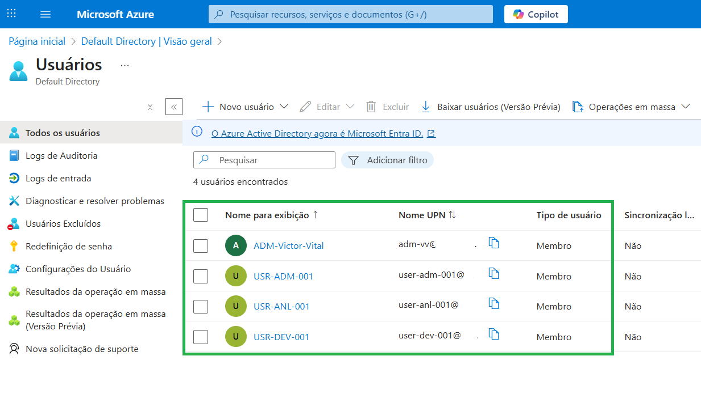
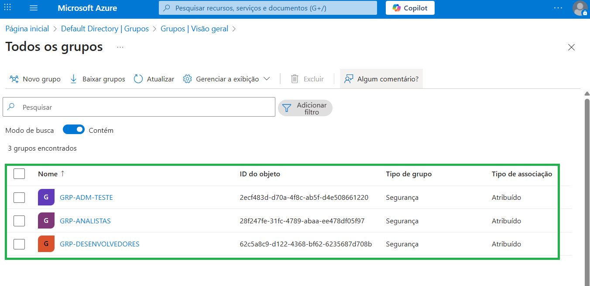
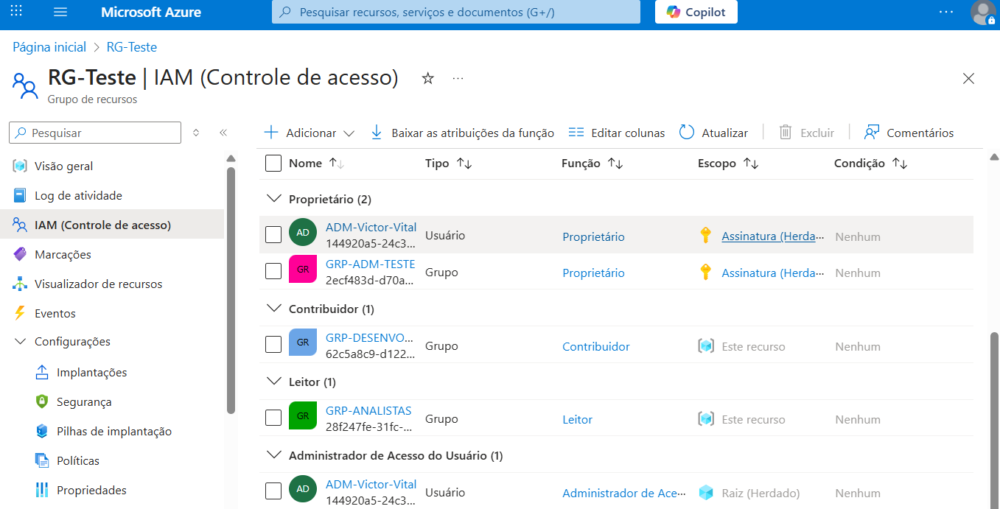

# Contas e Permissões

Neste arquivo, descrevo a configuração de usuários, grupos e permissões no projeto Azure IAM Hardening, com foco em entender na prática como o controle de acesso funciona dentro da Azure.

---
 
### Criação de Usuários

Criei usuários específicos para testes de permissões, simulando diferentes papéis dentro de um ambiente corporativo.

Usuários criados:

* Administrador-VictorVital: conta com permissões elevadas para administração do ambiente.

* Usuário-Dev: conta com permissões limitadas para desenvolvimento e testes controlados.

* Usuário-Anl: conta com permissões apenas para leitura.

* Usuário Admin-Teste: conta propositalmente configurada com permissões elevadas, a função "Owner" foi atribuida a esse usuário, que é o maior nível hierarquico de um usuário na Azure

*Imagem 6 - Lista de usuários.*

---

### Grupos de Usuários

Organizei os usuários em grupos para facilitar a aplicação de políticas de acesso e seguir boas práticas de RBAC.

Grupos criados:

* Grupo-Analistas – usuários com permissões de leitura no grupo de recursos.

* Grupo-Desenvolvedores – usuários com permissões limitdas ao desenvolvimento e testes controlados..

* Grupo-Adm-Teste - usuários com permissões elevadas, podendo criar, gerenciar e deletar recursos.

*Imagem 7 - Grupos de usuários.*

---

### Atribuição de Roles (RBAC)

Atribuí roles específicas a cada grupo, aplicando o princípio do mínimo privilégio:

* Owner – acesso total em Resource Groups selecionados.

* Contributor – criação e gerenciamento de recursos sem permissões administrativas completas.

* Reader – apenas visualização de recursos, sem alterações.

Essa etapa foi essencial para testar e compreender como diferentes papéis impactam o acesso a recursos e operações na Azure.

*Imagem 8 - Lista de RBAC criadas.*

---

### Observações Práticas

Durante a configuração, percebi alguns pontos importantes:

A separação de grupos facilita a aplicação de políticas consistentes e evita atribuições excessivas de permissões.

Testar diferentes combinações de usuários e roles ajuda a internalizar como o RBAC funciona no dia a dia.

---