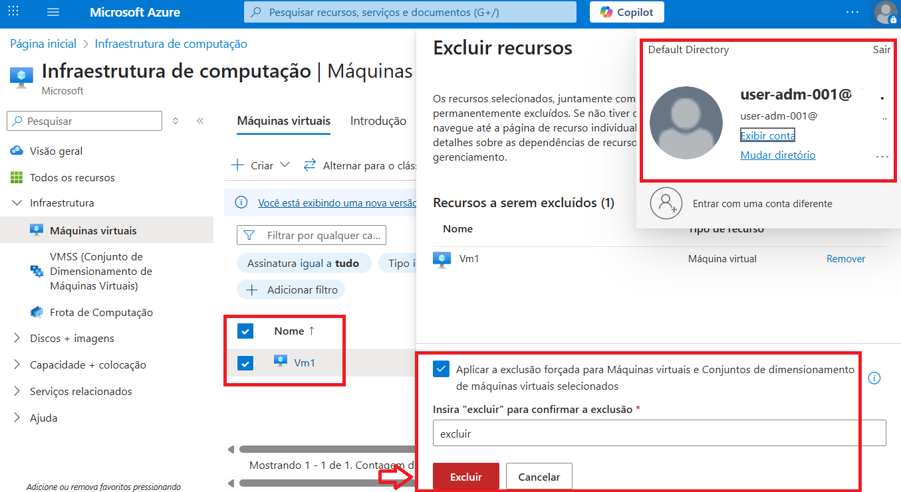

# Testes de Acesso

Neste arquivo, descrevo os testes práticos realizados no projeto Azure IAM Hardening, com foco em validar como os diferentes usuários e roles interagem com os recursos do Azure.

---

## Cenários de Testes

* #### Teste 1 - Usuário com a permissão somente para leitura (Reader) tenta criar, alterar e excluir recursos, além de tentar atribuir funções e criar novas roles (RBAC).

* #### Teste 2 - Usuário com a permissões para criar, alterar e excluir recursos, além de poder atribuir funções e criar novas roles (RBAC).

* #### Teste 3 - Usuário criado propositalmente com acesso privilegiado (Owner/ADM) com permissões para controlar praticamente todo o ambiente, simulando como um usuário com permissões elevadas pode prejudicar o ambiente, podendo excluir recursos e realizar escalonamento de privilégio. 

---

**RESULTADOS DO TESTE 1** 

Usuário Analista (Permissão somente para leitura) - verifiquei se o usuário com permissões limitadas conseguia criar novos recursos, atribuir funções e criar novas roles (RBAC).

*Imagem 9: um novo grupo de recursos não pode ser criado a partir do usuário Analista.*

---

*Imagem 10: Falha ao tentar criar uma VM com o usuário Analista.*

---

*Imagem 11: usuário Analista não tem as permissões necessárias para atribuir e criar funções para outros usuários.*

---

**RESULTADOS DO TESTE 2**

 Usuário Developer (Permissão para criar e alterar recursos) - tentativa de criar recursos, atribuir funções e criar novas roles (RBAC).

*Imagem 12: Usuário Dev obteve sucesso ao tentar criar uma Vm.*

---

*Imagem 13: Usuário Dev tem as permissões necessárias para atribuir e criar funções para outros usuários.*

---

*Imagem 14: Novo grupo de recursos criado a partir do Usuário Dev.*

---

**RESULTADOS DO TESTE 3**

 Usuário ADM (Permissões elevadas para gerenciar praticamente todo o ambiente) - simulação de como um usuário com permissões elevadas pode prejudicar o ambiente, podendo excluir recursos e realizar escalonamento privilégio.

*Imagem 15: o usuário ADM, com permissões elevadas é capaz de excluir recursos de forma intencional ou não.*

---

*Imagem 16: o usuário ADM, obteve sucesso ao tentar excluir uma VM.*

---

*Imagem 17: Escalonamento de privilégio, o usuário ADM é capaz de alterar funções e criar regras/roles personalizadas e atribuir a si mesmo e a outros usuários.*

---

### Procedimentos

Para cada teste, realizei os seguintes passos:

- Login no Portal Azure com o usuário do cenário.

- MFA ativo utilizando o Microsoft Authenticator em todas as contas

- Tentativa de realizar ações permitidas e não permitidas.

- Registro dos resultados e mensagens de erro recebidas.

- Comparação com as permissões configuradas via RBAC.

---

### Resultados Observados

Usuário Analista com permissões mínimas encontrou acesso restrito ao tentar criar recursos e RBAC conforme esperado, garantindo que o princípio do privilégio mínimo fosse respeitado.

Usuário Developer com permissões elevadas conseguiu gerenciar roles e recursos sem restrições, permitindo validar a configuração de permissões elevadas.

Usuário ADM com permissões de administrador conseguiu excluir recursos e escalonar privilégios, confirmando os perigos de uma má gestão de IAM.

Os testes ajudaram a identificar potenciais riscos e ajustes necessários na atribuição de roles.

### Aprendizados

Testar cenários práticos é essencial para compreender o impacto do RBAC.

Documentar os resultados ajuda a manter rastreabilidade das permissões e facilita futuros ajustes.